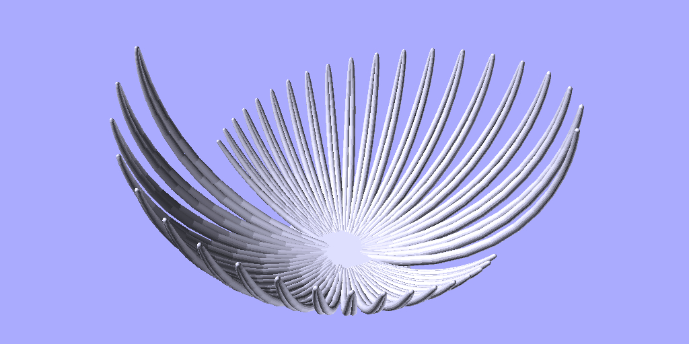

# Pendulum Bot

### Simulates random spherical pendulum and exports the traced path as an STL file for 3D printing!
### Automatically Tweets an image of the results and pushes the STL to this repo!

The code simulates a pendulum moving in three dimensions based on random initial conditions, and then stores the traced path. This path is then used to generate a "bowl" shape based on the motion of the pendulum as an OpenSCAD script.

The width of the traced path varies according to the pendulum's velocity. Narrower is slower, wider is faster.

If the code thinks that the pendulum's path has formed something resembling a bowl shape, it adds a "base" to the bottom of it to help the print. If you want to remove it, the OpenSCAD files are automatically pushed to this repo as well as the .STL, so it's easy to edit.

The non-bot, non-randomised version of this lives [here](https://github.com/walkerdanny/Pendulum_Bowl)

If you care, here's a [writeup](http://danny.makesthings.work/pendulum.html) and also a [short Twitter thread](https://twitter.com/walkerdanny/status/964792100800823298) on its development and my reasoning for it.
